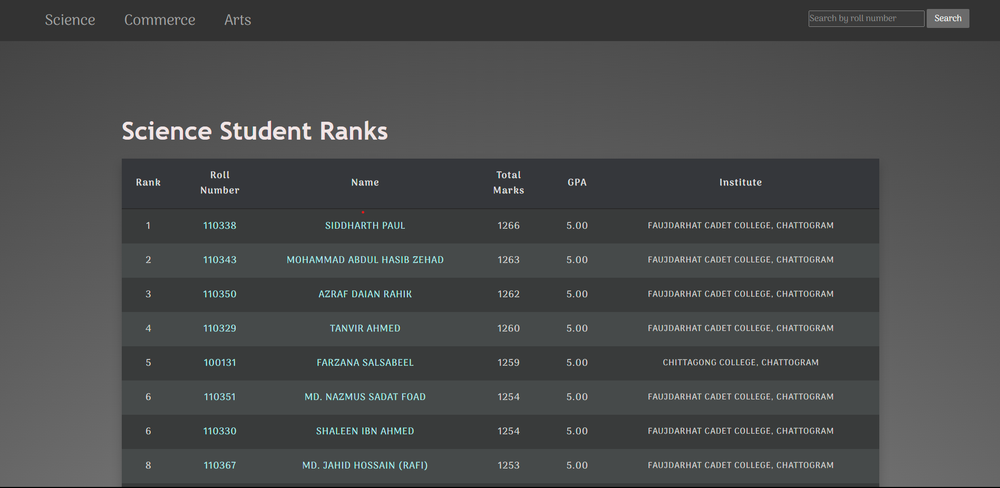
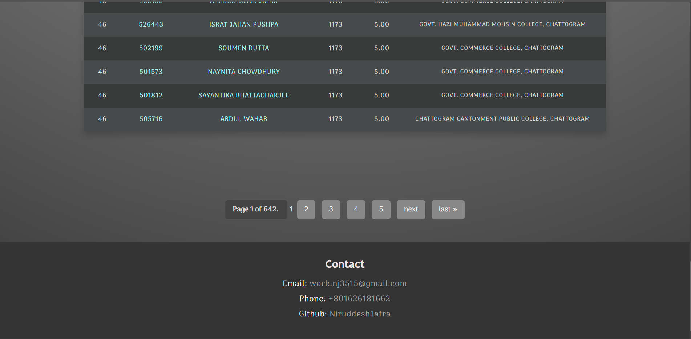
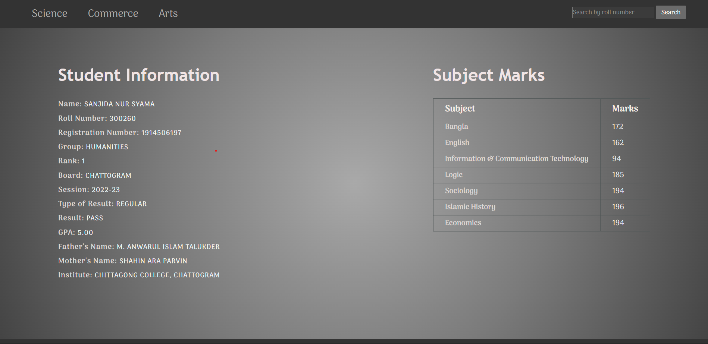

# HSC Rankings

HSC Rankings is a web application built with Django to display the ranking of students based on their Higher Secondary Certificate (HSC) exam results. It allows users to view the ranks of students across different groups (Science, Commerce, and Arts) and access detailed information about each student, including their individual subject marks and GPA.

## Table of Contents
- [Features](#features)
- [Project Structure](#project-structure)
- [Technologies Used](#technologies-used)
- [Setup Instructions](#setup-instructions)
- [Screenshots](#screenshots)
- [Contact](#contact)

## Features

- **Student Rankings**: Displays the rank of students based on their total marks and GPA.
- **Group-specific Results**: Allows users to filter rankings by Science, Commerce, and Arts groups.
- **Pagination**: Results are paginated to allow easy navigation of large datasets.
- **Search by Roll Number**: Users can search for individual students by roll number.
- **Student Details**: Each student has a detailed information page displaying personal info and marks in individual subjects.

## Project Structure

```
├───HSC_Rankings
│   └───__pycache__
├───Rankings
│   ├───management
│   │   └───commands
│   │       └───__pycache__
│   ├───migrations
│   │   └───__pycache__
│   ├───templates
│   └───__pycache__
├───static
│   ├───css
│   ├───images
│   └───js
└───templates
```

### Important Files:
- **`base.html`**: The base template file with common layout, navigation, and footer.
- **`results.html`**: Displays the ranks of students by group, with pagination and search functionality.
- **`individual_result.html`**: Shows detailed information about a specific student, including subject-wise marks.

## Technologies Used

- **Backend**: Django 5.1.1 (Python)
- **Database**: MySQL
- **Frontend**: HTML, CSS, JavaScript
- **Web Scraping**: Selenium (used to collect data from external sources)

## Setup Instructions

1. **Clone the Repository**
   ```bash
   git clone https://github.com/NiruddeshJatra/HSC_Rankings.git
   cd HSC_Rankings
   ```

2. **Create a Virtual Environment**
   ```bash
   python3 -m venv env
   source env/bin/activate  # For Linux/macOS
   # On Windows, use `env\Scripts\activate`
   ```

3. **Install Dependencies**
   Install all required packages from `requirements.txt`:
   ```bash
   pip install -r requirements.txt
   ```

4. **Set Up Database**
   Update your database configurations in `settings.py` and apply migrations:
   ```bash
   python manage.py migrate
   ```

5. **Run the Development Server**
   ```bash
   python manage.py runserver
   ```

6. **Access the Website**
   Open your browser and go to `http://127.0.0.1:8000/` to access the website.

## Screenshots







## License

This project is licensed under the MIT License - see the [LICENSE](LICENSE) file for details.


## Contact

- **Email**: [work.nj3515@gmail.com](mailto:work.nj3515@gmail.com)
- **Phone**: [+801626181662](tel:+801626181662)
- **GitHub**: [NiruddeshJatra](https://github.com/NiruddeshJatra)
